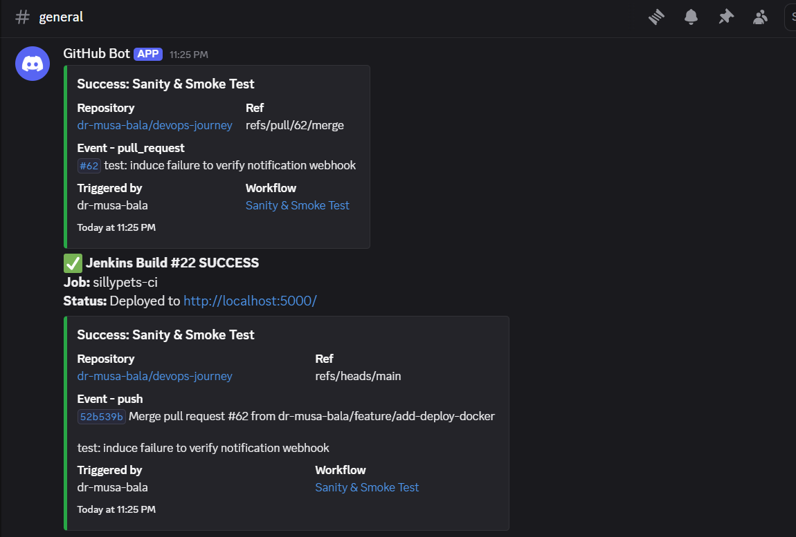
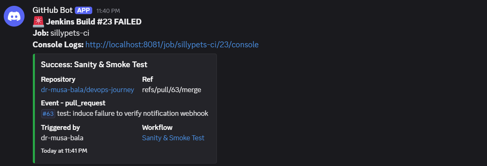

# SillyPets CI/CD Pipeline Documentation

This document provides complete technical documentation for the **SillyPets Automated CI/CD Pipeline**, covering system architecture, troubleshooting histories, pipeline stage breakdowns, and setup instructions.

---

## 1. Pipeline Overview & Architecture

The pipeline automates the complete continuous integration workflow for the **SillyPets** microservice: downloading source code, building a container image, running a transient container inside the Docker engine, executing automated health checks, and cleaning up test resources.

```
 [GitHub Repo] ──> (Stage 1: Fetch) ──> (Stage 2: Build Image) ──> (Stage 3: Run & Test) ──> [Cleanup]
                                                                          │
                                                                   curl http://test-sillypets

```

### Core Architecture Components

| Component | Function | Configuration / Context |
| --- | --- | --- |
| **Jenkins Controller** | Pipeline execution engine | Runs in Docker on a custom user-defined network |
| **Docker Engine** | Container runtime & build engine | Shared via Docker socket (`/var/run/docker.sock`) |
| **SillyPets App** | Target web application | Built from Dockerfile, exposed on standard web port |
| **Test Container** | Transient test environment | Spin up $\rightarrow$ Test via `curl` $\rightarrow$ Tear down |

---

## 2. Challenges Encountered & Navigation Steps

Building a containerized CI/CD pipeline inside a Docker-in-Docker / Docker-out-of-Docker environment introduces specific networking and lifecycle edge cases. Below are the sequential challenges faced during development and how each was navigated.

### Challenge 1: Connection Timeout During `curl` Health Check

* **Symptom:** The build stalled at Stage 3 for several minutes before failing with `curl: (7) Failed to connect to 172.17.0.x port 80: Connection timed out`.
* **Root Cause:** Network isolation between Docker networks. Jenkins was executing inside a custom user-defined bridge network (e.g., `sillypets-net`), while standard `docker run` launched `test-sillypets` onto the default `bridge` network (`172.17.0.0/16`). Containers on different Docker networks cannot communicate without explicit routing.
* **Navigation:**
1. Inspected Jenkins' environment to verify network mode.
2. Extracted the active network dynamically using `docker inspect` against the Jenkins container's hostname:
`JENKINS_NET=$(docker inspect -f '{{range $k, $v := .NetworkSettings.Networks}}{{$k}}{{end}}' $(hostname))`
3. Appended `--network "${JENKINS_NET}"` to the `docker run` command in the pipeline script, joining both containers to the exact same virtual network.


---

### Challenge 2: Brittle IP Address Scraping & DNS Resolution

* **Symptom:** Relying on extracting dynamic container IP addresses via `docker inspect` was fragile, complex, and prone to breaking across host environments.
* **Root Cause:** Standard default `bridge` networks do not support container-name-based DNS lookup, forcing reliance on raw IP addresses.
* **Navigation:**
1. Recognized that custom Docker networks feature an **embedded DNS server** (`127.0.0.11`).
2. Updated the test step to leverage Docker DNS directly: `curl -f "http://test-sillypets"`.
3. Added fallback conditional logic so the pipeline stays portable even if executed on standard default bridge networks.


---

### Challenge 3: Container Name Conflicts on Aborted Builds

* **Symptom:** Re-running a failed pipeline caused instant crashes with the error: `docker: Error response from daemon: Conflict. The container name "/test-sillypets" is already in use`.
* **Root Cause:** When an inline test failed, the shell script exited immediately, skipping manual cleanup commands placed at the end of the `sh` step.
* **Navigation:**
1. Extracted container teardown commands out of the `stages` block entirely.
2. Placed cleanup routines inside the declarative Jenkins `post { always { ... } }` lifecycle hook.
3. Added fallback shell flags (`|| true`) to `docker stop` and `docker rm` to ensure non-zero exit codes during cleanup never fail a build:
```groovy
post {
    always {
        sh "docker stop test-sillypets || true"
        sh "docker rm test-sillypets || true"
    }
}

```


---

## 3. Production Jenkinsfile Code

```groovy
pipeline {
    agent any

    environment {
        IMAGE_NAME = 'musabalaaudu/sillypets-image:V1.0'
        GIT_REPO   = 'https://github.com/dr-musa-bala/devops-journey.git'
    }

    stages {
        stage('1. Fetch Code from GitHub') {
            steps {
                echo "--> Pulling latest source code and Dockerfile..."
                git branch: 'main', url: "${GIT_REPO}"
            }
        }

        stage('2. Bake the App (Build)') {
            steps {
                echo "--> Building Docker image: ${IMAGE_NAME}..."
                sh "docker build -t ${IMAGE_NAME} ."
            }
        }

        stage('3. Taste Test (Test)') {
            steps {
                echo "--> Setting up dynamic container testing..."
                sh '''
                    # Navigated Issue #1: Detect current network context dynamically
                    JENKINS_NET=$(docker inspect -f '{{range $k, $v := .NetworkSettings.Networks}}{{$k}}{{end}}' $(hostname) 2>/dev/null || echo "bridge")
                    echo "Active Network Context: ${JENKINS_NET}"

                    # Navigated Issue #1 & #2: Attach test container to shared network
                    docker run -d --name test-sillypets --network "${JENKINS_NET}" ${IMAGE_NAME}
                    sleep 3

                    # Navigated Issue #2: Health Check via Embedded DNS or IP fallback
                    if [ "${JENKINS_NET}" != "bridge" ]; then
                        echo "Testing via Docker DNS (http://test-sillypets)..."
                        curl -f "http://test-sillypets" || exit 1
                    else
                        echo "Testing via direct IP fallback..."
                        CONTAINER_IP=$(docker inspect -f '{{range .NetworkSettings.Networks}}{{.IPAddress}}{{end}}' test-sillypets)
                        curl -f "http://${CONTAINER_IP}" || exit 1
                    fi
                '''
            }
        }
    }

    post {
        always {
            # Navigated Issue #3: Safe lifecycle teardown
            echo "--> Cleaning up test container artifacts..."
            sh "docker stop test-sillypets || true"
            sh "docker rm test-sillypets || true"
        }
        success {
            echo "🎉 YAY! The app was built and tested successfully!"
        }
        failure {
            echo "❌ Build failed. Check execution logs above."
        }
    }
}

```

---

## 4. Stage Breakdown Summary

* **Stage 1 (Fetch Code):** Checks out code from GitHub branch `main`.
* **Stage 2 (Bake/Build):** Builds and tags the local Docker image (`musabalaaudu/sillypets-image:V1.0`).
* **Stage 3 (Taste Test):** Detects container network, launches transient container, and runs `curl -f` endpoint verification.
* **Post Actions:** Guaranteed execution of container shutdown and removal regardless of stage outcomes.

---

## 5. Deployment Setup

1. **Update Jenkins Script:**
1. Open Jenkins (`http://localhost:8081`).
2. Go to **`sillypets-ci`** $\rightarrow$ **Configure**.
3. Replace the existing pipeline script with the code above.
4. Click **Save**.


2. **Execute & Verify:**
1. Click **Build Now**.
2. Open **Console Output** to verify automatic network detection and successful HTTP status testing.
---

# Jenkins Automation Journey: From Manual "Build Now" to Automated CI/CD

## 1. Executive Summary & Progression Overview
This document logs the step-by-step evolution of the `devops-journey` pipeline (`sillypets` containerized app). It tracks the exact progression from initial manual triggering to full GitHub Webhook automation, compilation error resolution, Git conflict navigation, and automated publishing to Docker Hub.

---

## 2. Phase 1: Initial Manual Pipeline Setup ("Build Now")

### Objective
Establish the baseline Jenkins Pipeline project and verify local execution.

### Actions Taken
1. Created a Pipeline project in Jenkins named `devops-journey`.
2. Linked the project to the source code repository: `https://github.com/dr-musa-bala/devops-journey.git`.
3. Executed initial build validation manually using the **Build Now** button on the Jenkins dashboard.
4. Confirmed that Jenkins successfully checked out the repository and executed basic shell stages on the host agent.

---

## 3. Phase 2: Transition to Automated GitHub Triggers (Webhooks)

### Objective
Eliminate manual triggers so that every `git push` or Pull Request event automatically wakes up Jenkins.

### Actions Taken
1. **Exposed Local Jenkins Instance:**
   Started an `ngrok` HTTP tunnel on port 8081 to generate a publicly accessible URL for local Jenkins (`http://localhost:8081`).
2. **Configured GitHub Webhook:**
   * Navigated to GitHub Repository Settings $\rightarrow$ **Webhooks** $\rightarrow$ **Add webhook**.
   * Payload URL: `http://<ngrok-id>.ngrok-free.app/github-webhook/`
   * Content type: `application/json`
   * Event triggers: Pushes and Pull Requests.
3. **Jenkins Configuration:**
   Enabled **GitHub hook trigger for GPRT polling** inside the pipeline configuration.

---

## 4. Phase 3: Automated Trigger, First Failure & Navigation to Green

### Event Trigger
Pushed changes to GitHub. The GitHub webhook successfully fired and notified Jenkins automatically without pressing "Build Now".

### The Incident: Groovy Compilation Failure
Jenkins picked up the build automatically, but the build failed instantly with the following stack trace:

```text
Started by GitHub push by dr-musa-bala
Obtained Jenkinsfile from git [https://github.com/dr-musa-bala/devops-journey.git](https://github.com/dr-musa-bala/devops-journey.git)
org.codehaus.groovy.control.MultipleCompilationErrorsException: startup failed:
WorkflowScript: 65: unexpected char: '#' @ line 65, column 1.
   #testing
   ^

1 error

```

### Root Cause Analysis

The `Jenkinsfile` contained a comment on line 65 using `#` (`#testing`). Jenkins evaluates `Jenkinsfile` scripts using **Groovy**, which requires `//` for single-line comments. `#` is invalid syntax in Groovy.

### Resolution Steps

1. Opened `Jenkinsfile` locally and navigated to line 65.
2. Replaced `#testing` with standard Groovy comment syntax: `// testing`.
3. Committed and pushed the change to GitHub:
```bash
git add Jenkinsfile
git commit -m "fix: change hash comment to double slashes in Jenkinsfile"
git push origin main

```


### Result: Build #17 (First Fully Automated Green Build)

* **Trigger:** Automated GitHub Push Webhook
* **Status:** SUCCESS
* **Duration:** 10 seconds
* **Log Output:**
```text
Revision: e0dd30d808462ac021acef4090a5e8abf07b7226
Commit: fix: change hash comment to double slashes in Jenkinsfile
Result: SUCCESS

```


---

## 5. Phase 4: Artifact Publishing & Docker Hub Integration

### Objective

Expand the pipeline beyond checkout to build a Docker container image and automatically push it to Docker Hub on every build.

### 1. Secure Credential Configuration in Jenkins

* **Path:** Manage Jenkins $\rightarrow$ Credentials $\rightarrow$ System $\rightarrow$ Global credentials (`Stores scoped from parent`).
* **Type:** Username with password
* **Authentication Method:** Generated a **Personal Access Token (PAT)** in Docker Hub (`dckr_pat_...`) rather than using account password.
* **Credential ID:** `docker-hub-credentials`

### 2. Updating `Jenkinsfile`

Appended stages for `Build Docker Image` and `Push to Docker Hub` with dynamic tags (`${env.BUILD_NUMBER}` and `latest`).

```groovy
pipeline {
    agent any

    environment {
        DOCKER_HUB_USER = 'dr-musa-bala'
        IMAGE_NAME      = 'sillypets'
        IMAGE_TAG       = "${env.BUILD_NUMBER}"
    }

    stages {
        stage('Checkout') {
            steps {
                checkout scm
            }
        }

        stage('Build Docker Image') {
            steps {
                script {
                    sh "docker build -t ${DOCKER_HUB_USER}/${IMAGE_NAME}:${IMAGE_TAG} ."
                    sh "docker tag ${DOCKER_HUB_USER}/${IMAGE_NAME}:${IMAGE_TAG} ${DOCKER_HUB_USER}/${IMAGE_NAME}:latest"
                }
            }
        }

        stage('Push to Docker Hub') {
            steps {
                script {
                    withCredentials([usernamePassword(credentialsId: 'docker-hub-credentials', usernameVariable: 'DOCKER_USER', passwordVariable: 'DOCKER_PASS')]) {
                        sh "echo \$DOCKER_PASS | docker login -u \$DOCKER_USER --password-stdin"
                        sh "docker push ${DOCKER_HUB_USER}/${IMAGE_NAME}:${IMAGE_TAG}"
                        sh "docker push ${DOCKER_HUB_USER}/${IMAGE_NAME}:latest"
                    }
                }
            }
        }
    }

    post {
        always {
            sh "docker logout"
        }
    }
}

```

---

## 6. Phase 5: Resolving Git Branching & Merge Conflicts

During the attempt to push the updated Docker `Jenkinsfile`, several Git synchronization issues occurred:

### Issue A: Non-Fast-Forward Push Rejection

* **Error:** `! [rejected] feature/my-test-branch -> feature/my-test-branch (non-fast-forward)`
* **Cause:** Remote repository had commits not present locally due to PR merges on GitHub.

### Issue B: Divergent Branch Warning

* **Error:** `fatal: Need to specify how to reconcile divergent branches.`
* **Fix:** Reconciled local and remote branches explicitly:
```bash
git pull origin feature/my-test-branch --no-rebase

```

### Issue C: Merge Conflict in `Jenkinsfile`

* **Error:** `CONFLICT (content): Merge conflict in Jenkinsfile`
* **Fix:**
1. Opened `Jenkinsfile` and deleted conflict indicators (`<<<<<<< HEAD`, `=======`, `>>>>>>>`).
2. Preserved the updated, clean pipeline code containing the Docker Hub build/push stages.
3. Committed and pushed the resolution:
```bash
git add Jenkinsfile
git commit -m "fix: resolve merge conflict in Jenkinsfile"
git push origin main

```


---

## 7. Phase 6: Final Verification (Build #18 - Full End-to-End Automation)

### Build Metrics

* **Build Number:** #18
* **Trigger:** Automatic GitHub push webhook (`cb9cb1c`)
* **Execution Time:** 23 seconds
* **Status:** SUCCESS

### Verified Artifact Outputs on Docker Hub

* `dr-musa-bala/sillypets:18`
* `dr-musa-bala/sillypets:latest`
---

# Jenkins CI/CD Automated Pipeline & Discord Notification Documentation

## 1. Executive Summary & Architecture Overview

This document logs the end-to-end continuous integration and continuous deployment (CI/CD) pipeline for the `sillypets-ci` application (`devops-journey` repository). It details GitHub webhook event handling, Docker automated image builds, registry publishing, deployment automation, and real-time Discord notification alerts for build states.

### Full Pipeline Flow

```
[ Feature Branch / PR ] ──► [ GitHub Webhook ] ──► [ ngrok Tunnel ] ──► [ Jenkins Server ]
                                                                                │
   ┌────────────────────────────────────────────────────────────────────────────┴────────────────────────────────────────────┐
   │ 1. Checkout SCM (refs/pull/* or main)                                                                                  │
   │ 2. Build Docker Image (${BUILD_NUMBER} & latest)                                                                       │
   │ 3. Authenticate & Push to Docker Hub                                                                                   │
   │ 4. Deploy Container to Port 5000 (`docker run`)                                                                        │
   └────────────────────────────────────────────────────────────────────────────┬────────────────────────────────────────────┘
                                                                                │
                                                   ┌────────────────────────────┴────────────────────────────┐
                                                   ▼                                                         ▼
                                       [ ✅ Success Webhook ]                                    [ 🚨 Failure Webhook ]
                                                   │                                                         │
                                                   └────────────────────────────┬────────────────────────────┘
                                                                                ▼
                                                                  [ Discord #general Channel ]

```

---

## 2. Notification Pipeline Configuration (`Jenkinsfile`)

Real-time notification hooks are embedded inside the `post` execution block of the `Jenkinsfile`, delivering status updates directly to Discord via incoming webhooks.

```groovy
pipeline {
    agent any

    environment {
        DOCKER_HUB_USER = 'musabalaaudu'
        IMAGE_NAME      = 'sillypets'
        IMAGE_TAG       = "${env.BUILD_NUMBER}"
        CONTAINER_NAME  = 'sillypets-live'
        APP_PORT        = '5000'
        WEBHOOK_URL     = 'https://discord.com/api/webhooks/YOUR_WEBHOOK_ID/YOUR_WEBHOOK_TOKEN'
    }

    stages {
        stage('Checkout') {
            steps {
                checkout scm
            }
        }

        stage('Build Docker Image') {
            steps {
                script {
                    sh "docker build -t ${DOCKER_HUB_USER}/${IMAGE_NAME}:${IMAGE_TAG} ."
                    sh "docker tag ${DOCKER_HUB_USER}/${IMAGE_NAME}:${IMAGE_TAG} ${DOCKER_HUB_USER}/${IMAGE_NAME}:latest"
                }
            }
        }

        stage('Push to Docker Hub') {
            steps {
                script {
                    withCredentials([usernamePassword(credentialsId: 'docker-hub-credentials', usernameVariable: 'DOCKER_USER', passwordVariable: 'DOCKER_PASS')]) {
                        sh "echo \$DOCKER_PASS | docker login -u \$DOCKER_USER --password-stdin"
                        sh "docker push ${DOCKER_HUB_USER}/${IMAGE_NAME}:${IMAGE_TAG}"
                        sh "docker push ${DOCKER_HUB_USER}/${IMAGE_NAME}:latest"
                    }
                }
            }
        }

        stage('Deploy Container (CD)') {
            steps {
                script {
                    sh "docker stop ${CONTAINER_NAME} || true"
                    sh "docker rm ${CONTAINER_NAME} || true"
                    sh "docker pull ${DOCKER_HUB_USER}/${IMAGE_NAME}:latest"
                    sh "docker run -d --name ${CONTAINER_NAME} -p ${APP_PORT}:80 ${DOCKER_HUB_USER}/${IMAGE_NAME}:latest"
                }
            }
        }
    }

    post {
        always {
            sh "docker logout"
        }

        success {
            sh """
                curl -H "Content-Type: application/json" \
                     -X POST \
                     -d '{"content": "✅ **Jenkins Build #${env.BUILD_NUMBER} SUCCESS**\\n**Job:** ${env.JOB_NAME}\\n**Status:** Deployed to http://localhost:${APP_PORT}/"}' \
                     ${WEBHOOK_URL}
            """
        }

        failure {
            sh """
                curl -H "Content-Type: application/json" \
                     -X POST \
                     -d '{"content": "🚨 **Jenkins Build #${env.BUILD_NUMBER} FAILED**\\n**Job:** ${env.JOB_NAME}\\n**Console Logs:** ${env.BUILD_URL}console"}' \
                     ${WEBHOOK_URL}
            """
        }
    }
}

```

---

## 3. Real-World Execution & Discord Verification Proof

### Test Case A: Build #22 — Success & Automated Deployment Alert

* **Trigger:** GitHub `pull_request` (#62) merge event into `refs/heads/main` (Commit: `52b539b`).
* **Job:** `sillypets-ci`
* **Result:** **SUCCESS**
* **Deployment Target:** `http://localhost:5000/`
* **Discord Alert Payload Verified:** `✅ Jenkins Build #22 SUCCESS | Status: Deployed to http://localhost:5000/`

---

### Test Case B: Build #23 — Synthetic Failure Alert

* **Trigger:** Synthetic failure test introduced on PR #63 (`refs/pull/63/merge`).
* **Job:** `sillypets-ci`
* **Result:** **FAILED**
* **Console Log Link:** `http://localhost:8081/job/sillypets-ci/23/console`
* **Discord Alert Payload Verified:** `🚨 Jenkins Build #23 FAILED | Console Logs: http://localhost:8081/job/sillypets-ci/23/console`

---

## 4. Summary of Verification Achievements

1. **Pull Request Automation:** Verified that Jenkins receives both `pull_request` preview triggers (`refs/pull/XX/merge`) and `push` triggers on `main`.
2. **Discord Success Hook Delivery:** Verified Build #22 automatically builds, publishes to Docker Hub, deploys to port 5000, and fires the green Discord webhook notification.

### Build #22 Success Alert


3. **Discord Failure Hook Delivery:** Verified Build #23 catches errors in the pipeline, aborts deployment, logs output, and fires the red failure webhook notification with direct console links.

### Build #23 Failure Alert


---
