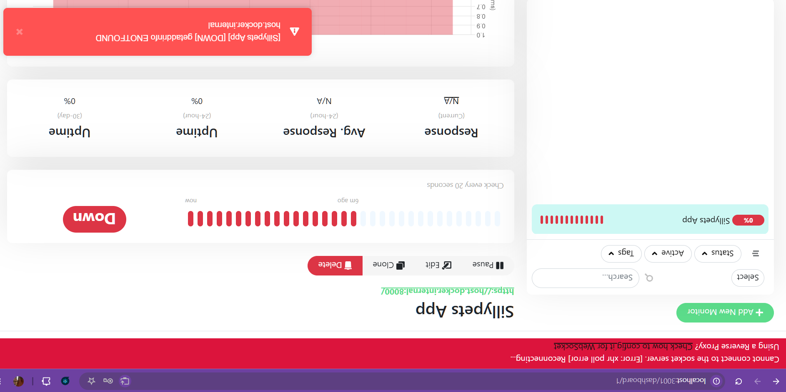
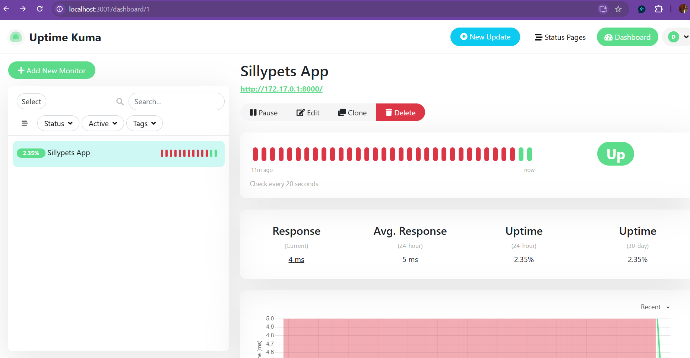
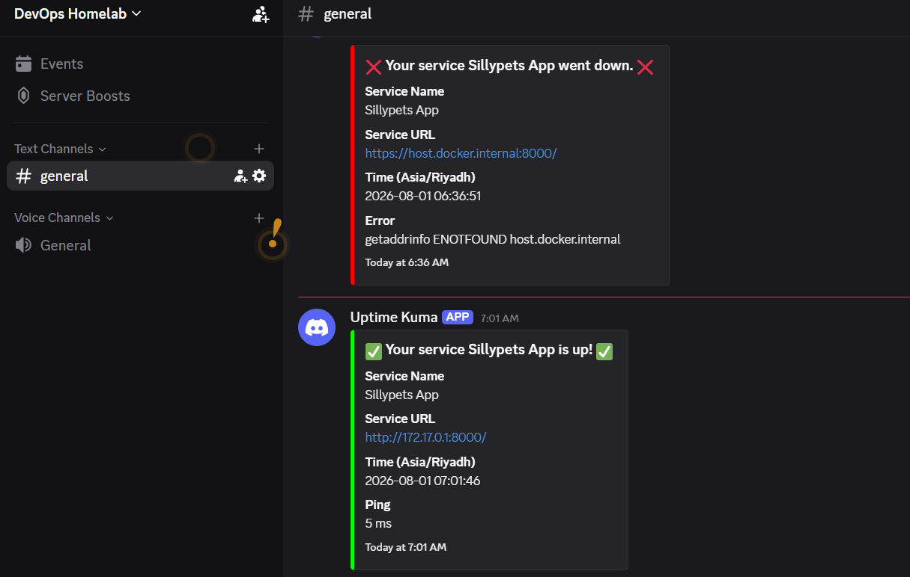

# Phase 8: Lightweight Uptime Monitoring & Observability

## 1. Overview & Architecture

Before expanding into heavy observability stacks (Prometheus/Grafana), Phase 8 focuses on establishing an **active, continuous out-of-band monitoring layer** using **Uptime Kuma**.

### CI/CD Smoke Check vs. Continuous Monitoring
* **CI/CD Smoke Check:** Runs once during pipeline execution for ~30 seconds to block broken code deployments.
* **Continuous Monitoring (Uptime Kuma):** Runs 24/7/365 in an independent container environment. It pings application endpoints at regular intervals (every 20 seconds) to catch post-deployment runtime failures (memory leaks, database drops, server crashes) and measure response latency over time.

---

## 2. Infrastructure Setup (Standalone Container)

Uptime Kuma was deployed as a standalone Docker container with persistent storage to maintain configuration across restarts.

```bash
docker run -d \
  --restart=always \
  -p 3001:3001 \
  --add-host=host.docker.internal:host-gateway \
  -v uptime-kuma:/app/data \
  --name uptime-kuma \
  louislam/uptime-kuma:1

```

### Key Parameters:

* `-p 3001:3001`: Exposes Uptime Kuma web dashboard on host port `3001`.
* `-v uptime-kuma:/app/data`: Named Docker volume ensuring SQLite database and configuration settings persist.
* `--add-host=host.docker.internal:host-gateway`: Maps host gateway for cross-container networking on Linux environments.

---

## 3. Incident & Error Troubleshooting Ledger

During initial configuration, several connectivity and deployment issues were encountered. Below is the complete diagnostic and resolution log.

### ❌ Issue 1: `getaddrinfo ENOTFOUND host.docker.internal`

* **Symptom:** Uptime Kuma status displayed `DOWN` with error `getaddrinfo ENOTFOUND host.docker.internal`.
* **Root Cause:** Unlike Docker Desktop (macOS/Windows), native Docker on Linux does not resolve `host.docker.internal` out-of-the-box.
* **Resolution:** Re-created the container passing the `--add-host=host.docker.internal:host-gateway` flag. Alternatively, routed traffic directly via the Linux Docker bridge IP (`172.17.0.1`).

---

### ❌ Issue 2: `curl: (7) Failed to connect to localhost port 8000`

* **Symptom:** `curl http://localhost:8000` returned a connection refusal error.
* **Root Cause:** The application container (`sillypets-app`) was not actively running on the host machine; previous CI/CD checks ran on ephemeral GitHub Action runners.
* **Resolution:** Spun up the target container locally to listen on host port `8000`.


### ❌ Issue 3: `Unable to find image 'sillypets-app:latest' locally`

* **Symptom:** `docker run -d --name sillypets-app -p 8000:8080 sillypets-app:latest` failed because Docker attempted to pull from Docker Hub.
* **Root Cause:** Local image tag mismatch.
* **Diagnostic Step:** Inspected local images using `docker images`.
* **Discovered Local Image:** `musabalaaudu/sillypets-image:V1.0`.
* **Resolution:** Executed container using exact repository name and version tag:
```bash
docker run -d --name sillypets-app -p 8000:80 musabalaaudu/sillypets-image:V1.0

```
---

### ❌ Issue 4: Monitor Remained RED After Container Launch

* **Symptom:** `sillypets-app` container was running (`Up`), but Uptime Kuma still reported `DOWN`.
* **Diagnostic Step:** Verified local host health endpoint:
```bash
curl -I http://localhost:8000

```


**Output:** `HTTP/1.1 200 OK` (Server: Nginx, Port mapping `0.0.0.0:8000->80/tcp`).
* **Root Cause:** Uptime Kuma inside its container network could not reach `host.docker.internal:8000` due to host routing restrictions.
* **Resolution:** Updated monitor endpoint URL in Uptime Kuma settings to target the Linux Docker bridge gateway IP directly:
```text
[http://172.17.0.1:8000/](http://172.17.0.1:8000/)

```

---

## 4. Verification & Current Status

* **Application Endpoint:** `http://localhost:8000` (`HTTP 200 OK`)
* **Monitoring Dashboard:** `http://localhost:3001`
* **Target Monitored URL:** `http://172.17.0.1:8000/`
* **Heartbeat Interval:** 20 Seconds
* **Operational Status:** **UP (GREEN 🟢)**

---

## 5. Next Planned Actions

1. Trigger simulated outage (`docker stop sillypets-app`) to verify Discord alert delivery.
2. Convert standalone CLI configurations into a multi-container `docker-compose.yml` file.

## 6. Phase 8.2: Infrastructure as Code (IaC) with Docker Compose

### 1. Architectural Evolution

To eliminate manual container management and hardcoded IP routing (`172.17.0.1`), the entire observability and application stack was refactored into a declarative **3-Tier Docker Compose Architecture**.

| Layer | Container / Service Name | Port Mapping | Purpose |
| :--- | :--- | :--- | :--- |
| **Tier 1 (Database)** | `sillypets-backend-db` (`db`) | Internal | PostgreSQL 15 relational storage |
| **Tier 2 (Web App)** | `sillypets-frontend-web` (`web`) | `8082:80` | Frontend Nginx application server |
| **Tier 3 (Observability)**| `uptime-kuma` | `3001:3001` | Out-of-band monitoring & alerting watchdog |

---
### 2. Service Discovery vs. IP Hacks

* **Old Method (Standalone CLI):** Uptime Kuma had to target the host bridge IP (`http://172.17.0.1:8000/`) because containers on the default Docker bridge cannot resolve each other by container name.
* **New Method (Docker Compose):** All three services sit on a user-defined bridge network (`sillypets-net`). Docker’s embedded DNS engine automatically resolves service names. Uptime Kuma now monitors:
  ```text
  http://web:80/


### 3. Complete Declarative Stack (`docker-compose.yml`)

```
services:
  # Tier 1: The Relational Database System
  db:
    image: postgres:15-alpine
    container_name: sillypets-backend-db
    environment:
      POSTGRES_USER: musa_admin
      POSTGRES_PASSWORD: SuperSecurePassword123
      POSTGRES_DB: sillypets_records
    volumes:
      - pgdata:/var/lib/postgresql/data
    networks:
      - sillypets-net

  # Tier 2: The Front-End Web Application
  web:
    image: musabalaaudu/sillypets-image:V1.0
    container_name: sillypets-frontend-web
    ports:
      - "8082:80"
    networks:
      - sillypets-net
    depends_on:
      - db # Ensures database launches prior to web layer

  # Tier 3: Continuous Monitoring Watchdog
  uptime-kuma:
    image: louislam/uptime-kuma:1
    container_name: uptime-kuma
    restart: always
    ports:
      - "3001:3001"
    volumes:
      - uptime-kuma-data:/app/data
    networks:
      - sillypets-net

# Permanent disk storage across container restarts
volumes:
  pgdata:
  uptime-kuma-data:

# Private network mesh connecting all tiers
networks:
  sillypets-net:
    driver: bridge

### 5. Verification Commands & Operational State


# Spin up all 3 tiers in background mode

docker compose up -d

# Verify container operational state

docker compose ps

* **Application Status:** `http://localhost:8082` (`HTTP 200 OK`)
* **Uptime Kuma Dashboard:** `http://localhost:3001`
* **Target Monitored Endpoint:** `http://web:80/`
* **Internal Resolution:** `sillypets-net` bridge mesh
* **Operational Health:** **UP (GREEN 🟢)**

## 7. Phase 8.3: Simulated Outage & Alert Verification

### 1. Incident Simulation Objective

Verify the full end-to-end observability and alerting pipeline under synthetic failure conditions using the multi-container Docker Compose architecture on `sillypets-net`.


### 2. Test Execution Timeline & Results

| Step / Action | Command / Trigger | Internal System Behavior | Dashboard & Alert Status |
| :--- | :--- | :--- | :--- |
| **1. Normal Baseline** | `docker compose up -d` | `sillypets-backend-db`, `sillypets-frontend-web`, and `uptime-kuma` running smoothly. | **UP (GREEN 🟢)** |
| **2. Trigger Outage** | `docker compose stop web` | The `web` container stops. Uptime Kuma's heartbeat ping to `http://web:80/` fails (`ECONNREFUSED`). | **DOWN (RED 🔴)** |
| **3. Discord Notification** | Automatic Webhook | Uptime Kuma fires an instant HTTP POST payload to Discord. | **ALERT DELIVERED 🚨** |
| **4. Trigger Recovery** | `docker compose start web` | The `web` container boots up. The next heartbeat ping returns `HTTP 200 OK`. | **RECOVERED (GREEN 🟢)** |
| **5. Discord Recovery** | Automatic Webhook | Uptime Kuma fires a resolution payload confirming service restoration. | **RESOLVED ALERT SENT 🟢** |

### 3. Alert Payloads Captured

* **Down Alert Received:**
  > 🔴 **[DOWN] Sillypets App**  
  > **Target:** `http://web:80/`  
  > **Error:** `connect ECONNREFUSED`  


* **Recovery Alert Received:**
  > 🟢 **[UP] Sillypets App**  
  > **Target:** `http://web:80/`  
  > **Ping:** `~2ms`  

### 4. Critical Technical Lessons Learned

1. **Embedded DNS Healing:** If container alias resolution fails across bridge networks, cycling the stack with `docker compose down && docker compose up -d` forces Docker's internal DNS resolver (`127.0.0.11`) to re-index all service endpoints on `sillypets-net`.
2. **Watchdog Health:** A monitoring tool can only alert if it is alive. Setting `restart: always` on the `uptime-kuma` service ensures the watchdog automatically recovers if the host reboots or crashes.
3. **Threshold Tuning:** Configuring a `20-second` heartbeat interval and `1` max retry count gives near-instant incident response without overwhelming alert channels with noise.

### 📸 Visual Verification & Proof

#### 1. Uptime Kuma Status Dashboard

| Outage State (Red) | Recovery State (Green) |
| :---: | :---: |
|  |  |

#### 2. Discord Real-Time Alert Delivery




