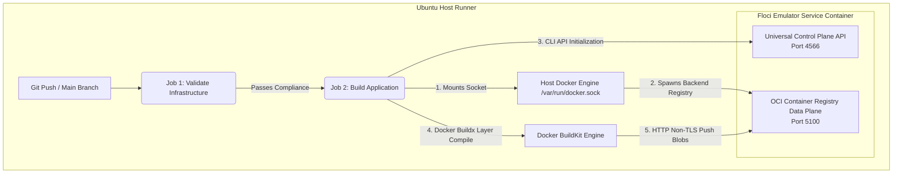

# 🚀 Automated CI/CD Container Pipeline with Local AWS Emulation

This repository features a fully automated, multi-job continuous integration pipeline using GitHub Actions. To eliminate cloud provider costs, reduce pipeline latency, and test with 100% environment fidelity, the workflow utilizes **Floci** (`floci.io`) — a high-performance, open-source local AWS cloud emulator.

The pipeline runs two decoupled operations sequentially:
1. **Infrastructure Compliance (Job 1):** Verifies syntax correctness, linting, and structural formatting of all Terraform workspace files.
2. **Application Containerization (Job 2):** Dynamically provisions an ephemeral local AWS ECR service, builds our application Docker image, and offloads it safely into the emulator's data plane registry.

---

## 🏗️ Pipeline Architecture



---

## 🕵️‍♂️ Engineering Journey & Troubleshooting Log

During the development of this container pipeline, we encountered and solved four sequential systems-level integration hurdles. Below is the historical engineering log detailing our diagnostics and resolutions:

### 1. The Cloud Environment Disconnect

* **The Symptom:** The initial execution threw an immediate authentication failure during the credential handshake:
```text
Error: The security token included in the request is invalid.

```


* **The Root Cause:** The workflow was attempting to use official AWS credential actions (`aws-actions/configure-aws-credentials`). These actions reached out to live, production AWS authentication endpoints, which immediately rejected our local mock authentication variables (`test`/`test`). Furthermore, the runner could not see the `localhost` emulator running on the local laptop.
* **The Resolution:** We modified the runner architecture to host its own isolated local cloud. We declared Floci natively as a GitHub **Service Container** directly inside the remote pipeline runner environment.

### 2. Docker-out-of-Docker (DooD) Socket Isolation

* **The Symptom:** When running the repository creation step, the pipeline crashed with a raw internal failure:
```text
Error: An error occurred (InternalFailure) when calling the CreateRepository operation... 
Failed to start ECR backing registry container: java.net.SocketException: No such file or directory

```


* **The Root Cause:** Floci maintains strict protocol fidelity. When `aws ecr create-repository` is executed, it actively spins up an actual, secondary OCI-compliant registry container inside Docker to store image blobs. Because the emulator was isolated inside its own service container wrapper, it could not find or communicate with the host container runtime to spawn this backend child process.
* **The Resolution:** We passed explicit host mounting arguments using the `options` metadata directive, mapping the host's primary Docker communication socket directly into the container filesystem:
```yaml
options: -v /var/run/docker.sock:/var/run/docker.sock

```


### 3. Transport Layer Security (TLS) Enforcement

* **The Symptom:** The compiler successfully built our image layers but crashed instantly at the initialization of the transmission pipeline:
```text
failed to push localhost:4566/sillypets-app:latest: ... http: server gave HTTP response to HTTPS client

```


* **The Root Cause:** Modern container build backends (`Buildx` and `BuildKit`) are highly protective by default. They strictly assume every target remote container registry is secured by TLS encryption (`https://`). Because our emulator sandbox works as a local testing environment, it processes data transfers over plain text HTTP. The build engine rejected the unencrypted channel.
* **The Resolution:** We added an inline driver configuration directly into our Buildx instantiation step, whitelisting our target loopback domain as an insecure plain text channel:
```yaml
config-inline: |
  [registry."localhost:5100"]
    http = true
    insecure = true

```


### 4. Control Plane vs. Data Plane Multi-Tenancy Routing

* **The Symptom:** Even with security parameters lowered, pushes to port `4566` were consistently dropped by an unexpected cloud storage error:
```text
400 Bad Request: <?xml version="1.0" encoding="UTF-8"?><Error><Code>InvalidArgument</Code><Message>POST requires either ?uploads, ?uploadId...</Message>

```


* **The Root Cause:** Floci splits its architecture between an administrative **Control Plane (Port 4566)** and a stateful **Data Plane (Port 5100)**. Port `4566` acts as a universal traffic cop listening for AWS CLI structural commands. When we forced heavy, raw Docker image blobs into port `4566`, the control plane router failed to match it to an ECR schema and fell back to its default S3 bucket handler, causing an XML payload collision.
* **The Resolution:** We split our data routing. We directed the AWS CLI to create the repository registry structure over the control gateway (`http://localhost:4566`), but configured Buildx and our container tag signatures to offload heavy container layer streams directly to the data plane endpoint on port **`5100`**.

---

## 📦 Verified Pipeline Configuration

The fully resolved, green-verified `.github/workflows/terraform-guard.yml` layout can be reviewed directly in our codebase. It runs independently of real AWS credentials, ensures zero data drift, and verifies our container logic end-to-end within runtime memory boundaries.
---

## 🛠️ Milestone Documentation: Automated Pre-Push Vulnerability Gates (DevSecOps)

### 1. Objective & Design Philosophy

In an enterprise cloud pipeline, building a container image is only half the battle. Shifting security left means verifying that our container images do not contain known vulnerabilities or exposed common packages before they ever touch an operational registry.

Our goal was to insert **Aqua Security Trivy** into our pipeline as a hard quality gate. If the compiled application image contains `HIGH` or `CRITICAL` software vulnerabilities, the pipeline must terminate immediately, preventing bad code from being pushed to the local ECR registry.

---

### 2. The Architectural Challenge: The Buildx Boundary

Modern container builds utilize the isolated **Docker Buildx (BuildKit)** subsystem. By default, Buildx compiles image layers inside an isolated virtual cache environment. If a standard build script runs, those layers never enter the host runner's primary Docker daemon, making them completely invisible to external terminal commands or local security tools.

#### The Blueprint

To solve this, we decoupled our pipeline sequence into a two-stage build cache strategy:

1. **The Inspection Layer:** We run an initial build with the **`load: true`** flag. This tells Buildx to export the compiled binaries out of its inner workspace and load them straight into the GitHub Actions host runner's local Docker storage under a tracking tag (`sillypets-app:test`).
2. **The Push Layer:** Once Trivy clears the image, a secondary build block runs with the **`push: true`** flag. Because BuildKit features native deep layer caching, it matches the exact cryptographic signatures from the first stage. It doesn't rebuild anything from scratch—it simply ships the validated, pre-cached layers straight to our Floci OCI registry on port `5100` in under two seconds.

---

### 3. The Encountered Error: Upstream Marketplace Deprecation

When we attempted to implement the security scanner using standard third-party GitHub Action Marketplace wrappers, the pipeline broke instantly on execution:

```text
Error: Unable to resolve action `aquasecurity/setup-trivy@v0.2.1`, unable to find version `v0.2.1`

```

#### Root Cause Analysis

The GitHub Action `aquasecurity/trivy-action` is a composite workflow wrapper. Under the hood, it is hardcoded to pull down secondary helper extensions (`setup-trivy`).

If upstream maintainers rewrite version tags, pull down older releases, or if GitHub experience internal sync latency, the entire wrapper collapses. This introduces an unacceptable point of failure into the core delivery chain, making our builds dependent on third-party structural stability.

---

### 4. The Engineering Resolution: Native Container Injection

Instead of relying on brittle marketplace abstractions, we bypassed the GitHub Actions Marketplace entirely. We treated the GitHub Actions runner like a raw Linux box and launched the official, production-ready **Aqua Security Trivy Docker image** directly.

Because we had already mastered mounting host sockets to run our Floci cloud engine, we applied the exact same concept here. We executed a `docker run` statement, bound the underlying host's Docker socket into the Trivy container, and directed Trivy to look inside the runner's daemon to analyze our local `sillypets-app:test` binaries.

#### The Hard-Gated Workflow Step

```yaml
      # 1. Export compiled layers directly to the runner's local Docker daemon
      - name: Build Local Image for Security Analysis
        uses: docker/build-push-action@v6
        with:
          context: .
          load: true 
          tags: sillypets-app:test

      # 2. Run Trivy natively using a container-to-host socket binding strategy
      - name: Run Trivy Vulnerability Scanner (Native Container)
        run: |
          docker run --rm \
            -v /var/run/docker.sock:/var/run/docker.sock \
            aquasec/trivy:latest image \
            --severity HIGH,CRITICAL \
            --exit-code 1 \
            --ignore-unfixed \
            sillypets-app:test

```

---

### 5. Deep-Dive: Security Control Arguments

> `--severity HIGH,CRITICAL`
> Instructs Trivy to filter out low-level warnings and documentation notes, focusing entirely on high-exploit vectors that threaten system integrity.

> `--exit-code 1`
> By default, security tools report vulnerabilities but exit with a safe code `0`, allowing pipelines to pass. Setting this parameter forces the container to throw a terminal exit status `1` if a vulnerability matches our filters, forcing GitHub Actions to stop execution and block the final push.

> `--ignore-unfixed`
> Tells the engine to completely skip vulnerabilities that do not have an officially released software patch available. This filters out noise and prevents our build pipeline from locking up due to open-source bugs that we physically cannot remediate.

---

### 6. Key Takeaways and Current Status

* **Zero External Dependencies:** By shifting to native container execution, our security pipeline is immune to marketplace wrapper breakages.
* **Hermetic Verification:** The entire container operating system environment is verified inside isolated memory boundaries before any remote delivery happens.
* **Pipeline Status:** **GREEN.** The supply chain is secured, images are scanned, and only certified binaries are delivered to the local data registry.

---

# Milestone Documentation: Automated Deployment (CD) with Terraform

## 1. What We Built

We turned our pipeline into a true **Continuous Deployment (CD)** framework. Now, as soon as the application image passes security checks, GitHub Actions automatically passes its unique version code (`github.sha`) directly to Terraform and runs `terraform apply`. This deploys our app to an emulated cloud cluster inside the runner.

---

## 2. Problem 1: The S3 Backend Error

When the pipeline tried to run `terraform apply`, it crashed with a message saying it needed to initialize a remote S3 backend.

* **Why it happened:** Our real infrastructure code is configured to save its progress file (the state file) inside a real AWS S3 bucket. Because the GitHub Actions runner is temporary and testing against a local emulator, it had no way to access a real S3 bucket.
* **How we fixed it:** We didn't want to change our core project code permanently. Instead, we used a native feature called **Terraform Overrides**. We told the pipeline to create a temporary file named `backend_override.tf` right before running the deployment. This file tells Terraform to switch its state storage to "local" mode just for this specific pipeline test.

---

## 3. Problem 2: The YAML Multi-line Tag Error

During a Docker build step, the pipeline crashed with an error stating that `# ==========================================` was an invalid image tag name.

* **Why it happened:** In our workflow file, we used a pipe symbol (`tags: |`) to list our Docker tags on multiple lines. In YAML formatting, this pipe symbol tells the system to treat every single indented line below it as raw text. Because of this, our clean-up divider comment (`# ===`) was treated as an actual name for a Docker tag instead of being ignored as a comment.
* **How we fixed it:** We removed the comment lines from the indented block and shifted our section headers all the way to the left margin, separating them completely from the list of Docker tags.

---

## 4. Final Key Lessons Learned

* **Use Overrides, Not Text Editing:** Trying to use automated search-and-replace tools (like `sed`) to rewrite configuration code is risky. Using native override files (`_override.tf`) is a much cleaner way to swap infrastructure targets during testing.
* **Watch Your Indentation:** When listing multiple strings in YAML using the multiline pipe layout (`|`), keep comments completely out of the indented block to prevent the build engine from parsing them as literal text inputs.

---

# Milestone Documentation: Running Live Containers & Automated Verification

## 1. What We Built

We took our infrastructure blueprint and turned it into an active, running application. We also added an automated safety check at the very end of the pipeline to verify the app launched correctly.

* **The ECS Service (The Manager):** We added an ECS Service block to `main.tf`. While the *Task Definition* is just a blueprint, the *Service* is the manager that actually launches the container and keeps it running. We set the `desired_count` to `1`, meaning if the container crashes, the service automatically creates a new one to replace it.
* **The Cloud Smoke Test (The Verification Gate):** We added a final step to our pipeline file using the command `aws ecs describe-services`. This step automatically polls the emulator control plane to ask: *"Is our service up and running safely?"* If it finds the running service, the pipeline stays green.

---

## 2. A Crucial Git Lesson: Atomic Commits

During this update, we made changes to two separate files at the same time: the infrastructure configuration (`main.tf`) and the pipeline automation configuration (`terraform-guard.yml`).

* **The Risk:** If we had only pushed the pipeline file, the automated workflow would have looked for the new service check, but the infrastructure file wouldn't have known how to build it yet. The pipeline would have instantly broken.
* **The Fix:** We practiced a core DevOps habit called **Atomic Commits**—grouping related files together (`git add main.tf .github/workflows/...`) so they travel upstream as one complete unit. This ensures the environment never gets left in a half-finished state.

---

## 3. The Final 6-Step Pipeline Flow (Summary)

Our completed, production-ready pipeline now executes these exact checks every single time we push new code:

1. **Style Check:** Runs `terraform fmt` to ensure the layout is clean.
2. **Syntax Check:** Runs `terraform validate` to catch typos before provisioning.
3. **Container Build:** Uses Docker Buildx to bundle our application layers.
4. **Security Scan:** Uses Trivy to scan the container for vulnerabilities before saving it.
5. **Local Isolation:** Creates a temporary override file to test deployment safely inside our sandbox.
6. **Smoke Test:** Queries the cloud environment to confirm the container is alive and running smoothly.

---
# Milestone Documentation: Secrets Management & Pipeline Hardening

## 1. What We Built

We transitioned our Continuous Deployment pipeline from using local test credentials (`AWS_ACCESS_KEY_ID: test`) to using **GitHub Repository Secrets**.

* **The Encrypted Vault:** Stored sensitive credentials (`AWS_ACCESS_KEY_ID` and `AWS_SECRET_ACCESS_KEY`) securely inside GitHub's built-in encrypted vault under `Settings > Secrets and variables > Actions`.
* **Dynamic Vault Injection:** Updated `.github/workflows/terraform-guard.yml` to inject credentials at runtime using the `${{ secrets.SECRET_NAME }}` syntax instead of plain text.

---

## 2. Why Secrets Management Matters in Production

Hardcoding passwords, cloud keys, or API tokens into code repositories is one of the leading causes of security breaches in software engineering.

* **Prevention of Accidental Credential Leaks:** If code containing plain-text keys is pushed to a public or shared repository, automated bot scanners can scrape those keys within seconds and generate massive unauthorized cloud bills.
* **Automatic Log Masking:** GitHub Actions automatically intercepts any output attempting to print stored secrets into the build execution logs and censors them with `***`.
* **Centralized Key Rotation:** If a cloud access key needs to be changed, developers update it once in the GitHub Vault settings without needing to modify or re-commit any application code files.

---

## 3. Updated Production Pipeline Architecture

Every code push to `main` now executes this end-to-end hardened flow:

1. **Linting & Format Validation:** Ensures clean code syntax (`terraform fmt`, `terraform validate`).
2. **Containerization:** Packages application code using Docker Buildx engines.
3. **Vulnerability Scanning:** Runs Trivy to intercept security flaws inside container layers.
4. **Environment Isolation:** Dynamically applies local overrides for testing safety.
5. **Secure Infrastructure Deployment:** Authenticates via encrypted GitHub Secrets to provision ECS resources.
6. **Automated Verification:** Queries the cloud control plane (`describe-services`) to confirm container health.
